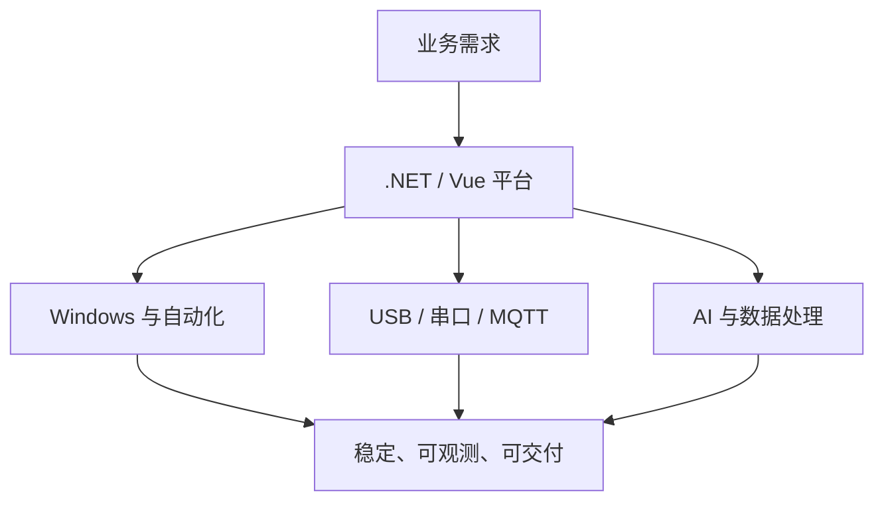

### 让软件真正连接业务、设备与现实世界

高级 .NET / C# 开发者，长期专注于企业级系统、Windows 桌面应用、USB/串口设备、远程硬件接入、嵌入式设备与本地 AI 工程化。

## 👋 关于我

我喜欢解决那些横跨多个技术边界、最终必须稳定落地的问题：从 ASP.NET Core API、Vue 管理端和 WPF 客户端，到 Windows 驱动与系统 API、USB Hub、UKey、CH340 串口、MQTT 和 ESP32 固件；也持续探索本地大模型、视觉识别、TTS 与 AI Agent 在真实业务中的应用。

- 🔭 当前方向：`.NET 10`、DDD / Clean Architecture、RPA、远程 USB、嵌入式墨水屏、本地 AI
- 🧩 擅长领域：复杂系统拆解、软硬件链路诊断、长期运行稳定性、跨平台部署与工程化交付
- 🛠️ 工作方式：先打通完整闭环，再用架构、监控、测试和自动化提高可复用性
- 💡 长期目标：构建可沉淀、可组合、可持续演进的基础平台与工具链

## 🧰 技术栈

| 方向 | 技术与实践 |
| --- | --- |
| 后端与架构 | .NET 10、ASP.NET Core、DDD、Clean Architecture、JWT、SignalR、EF Core、AOT |
| 桌面与自动化 | WPF、WinForms、FlaUI、CefSharp、Windows API、RPA、服务与任务调度 |
| 前端与数据 | Vue 3、TypeScript、Element Plus、Ant Design、SQLite、MySQL、REST、WebSocket |
| 硬件与物联网 | USB / USB/IP、VirtualHere、UKey、CH340、SerialPort、MQTT、ESP32、电子墨水屏 |
| AI 与多媒体 | 本地 LLM、llama.cpp、ROCm / Vulkan、YOLO、OCR、TTS、音视频处理、AI Agent |
| 工程与交付 | Docker、GitHub Actions、Windows / Linux 单文件发布、日志监控、诊断与自动恢复 |

## 🚀 最近项目

<table>
<tr>
<td width="50%" valign="top">

### [MyBaseSystem](https://github.com/sunkejava/MyBaseSystem)

基于 **.NET 10 + Vue 3** 的通用基础系统。后端采用 DDD 与 Clean Architecture，覆盖认证、权限、菜单、用户、角色、审计、健康检查与容器部署，面向后续业务长期复用。

`C#` `Vue 3` `DDD` `Clean Architecture`

</td>
<td width="50%" valign="top">

### [AirPageSystem](https://github.com/sunkejava/AirPageSystem)

面向电子墨水屏的快照管理与定时推送平台。支持行情、系统监控、3x-ui、自定义 JSON 和图片模板，提供用户权限、设备管理、Cron 调度与多平台发布。

`.NET 10` `Vue 3` `E-Ink` `Scheduler`

</td>
</tr>
<tr>
<td width="50%" valign="top">

### [CrossMux](https://github.com/sunkejava/crossmux)

面向 Xteink X3/X4 的社区增强固件：中文阅读、微信读书、阅读统计、桌面模拟器、文件同步、MQTT 智能待机，以及一组适配墨水屏的工具和小游戏。

`ESP32-C3` `C++` `MQTT` `E-Paper`

</td>
<td width="50%" valign="top">

### [VideoCrawler](https://github.com/sunkejava/VideoCrawler)

围绕视频内容采集、解析与管理的工程实践，体现 Web 数据接入、任务编排及多媒体处理方向的持续探索。

`.NET` `Crawler` `Video` `Automation`

</td>
</tr>
<tr>
<td width="50%" valign="top">

### [SuperNAT](https://github.com/sunkejava/SuperNAT)

围绕网络穿透、代理和远程访问场景的实践项目，聚焦复杂网络环境下的连接管理与服务化部署。

`C#` `Networking` `NAT` `Proxy`

</td>
<td width="50%" valign="top">

### [Common.Utility](https://github.com/sunkejava/Common.Utility)

多年日常开发沉淀的 C# 实用工具集合，覆盖网络、文件、加密、序列化、文档、图像、任务与常用扩展。

`C#` `.NET` `Utilities` `Toolbox`

</td>
</tr>
</table>

> 部分企业项目、远程 USB/UKey 平台、RPA 系统与硬件控制项目为非公开仓库。公开主页仅展示经整理后适合分享的项目与技术实践。

## 🧭 我在解决的问题

我关注的不只是功能是否能运行，更在意系统在真实环境中能否长期稳定：设备掉线如何定位、驱动调用如何防卡死、任务怎样可靠执行、异常怎样自动恢复，以及功能怎样沉淀为下一套系统仍可复用的能力。

## 📊 GitHub 概览

## 🤝 联系我

如果你也关注 .NET 工程化、Windows 自动化、远程 USB、串口与硬件稳定性、嵌入式墨水屏或本地 AI，欢迎通过 [GitHub Issues](https://github.com/sunkejava) 或邮件交流。

**Code connects systems. Engineering keeps them running.**

持续构建，持续复盘，持续把复杂问题做成可靠产品。

